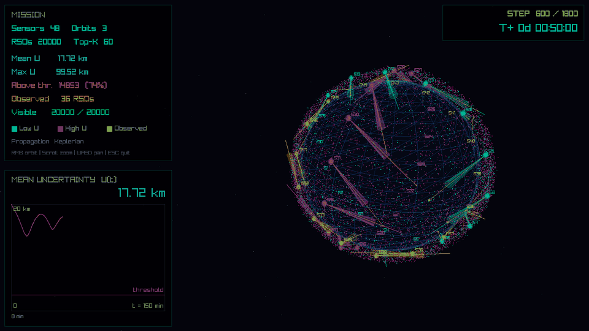
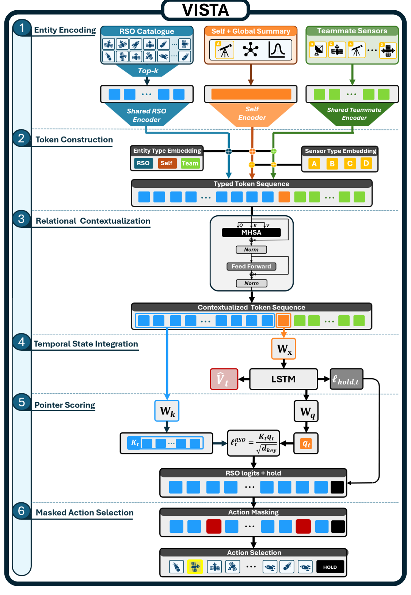

# VISTA: An Attention-Based Multi-Agent Reinforcement Learning Architecture for Space Situational Awareness Sensor Tasking

VISTA combines bounded entity-centric attention, a recurrent temporal core, and
adaptive pointer selection over changing candidate sets. Each agent controls one
sensor while encoding targets and teammates as entities, supporting
heterogeneous-network coordination. Shared encoders preserve token-to-object
correspondence and accommodate changing candidate and teammate counts. All
agents jointly optimize the same distributed policy under a catalogue-level
objective, then execute it from their own local observations.



This repository contains the three paper scenarios (Phase I–III) as native C
environments, frozen pretrained checkpoints, classical scheduling baselines,
and the data + scripts behind the paper figures. Everything runs through a
single `vista` command on top of the public [PufferLib](https://github.com/PufferAI/PufferLib) 3.0 trainer.

## Architecture



---

## Scenarios and pretrained policies

| Preset | Scenario | Agents | Catalogue | Policy |
|---|---|---|---|---|
| `phase1_vista` | Phase I — single-sensor tasking | 1 | 30 RSOs | VISTA (attention + LSTM + pointer) |
| `phase1_lstm` | Phase I — recurrent baseline | 1 | 30 RSOs | LSTM |
| `phase2_vista` | Phase II — LEO constellation, large catalogue | 12 (3 orbits) | 2000 RSOs | VISTA |
| `phase2_lstm` | Phase II — recurrent baseline | 12 (3 orbits) | 2000 RSOs | LSTM |
| `phase3_vista` | Phase III — heterogeneous cooperative network | 4 (2 sensor types) | 240 RSOs | VISTA |

Each preset is a frozen `configs/<preset>.ini` + `checkpoints/<preset>.pt` pair.
SHA-256 hashes and training-run provenance live in
[checkpoints/manifest.json](checkpoints/manifest.json) and
[docs/REPRODUCIBILITY.md](docs/REPRODUCIBILITY.md).

## Installation

Requirements: **Linux x86_64 or WSL2**, **Python 3.12**, a C compiler (`gcc`),
and `git`. Keep the repository checkout available: presets and checkpoints
are loaded from its `configs/` and `checkpoints/` directories. GPU is optional (evaluation runs fine on CPU; training is much
faster on CUDA).

```bash
git clone https://github.com/RocketNeurons/VISTA-SSA.git && cd VISTA-SSA

# 1. Create and activate a virtual environment
python3.12 -m venv .venv
source .venv/bin/activate
pip install --upgrade pip

# 2. Install PyTorch FIRST, matching your hardware
#    GPU (CUDA 12.x toolkit installed):
pip install torch==2.9.1 --index-url https://download.pytorch.org/whl/cu126
#    CPU only:
# pip install torch==2.9.1 --index-url https://download.pytorch.org/whl/cpu

# 3. Fetch the pinned Raylib build dependency (SHA-256 verified before extraction)
python scripts/fetch_build_dependencies.py

# 4. Install VISTA (compiles the three native environments)
pip install -e .
```

**Only needed for `train` / `sweep`** (evaluation works without it): PufferLib's
PPO kernel must be compiled against *your* installed torch, so rebuild it
without pip's isolated build environment:

```bash
pip install --force-reinstall --no-deps --no-build-isolation --no-cache-dir pufferlib==3.0.0
```

Sanity check:

```bash
vista list
```

### Install troubleshooting

- `ImportError: ... pufferlib/_C ... undefined symbol` when training — the PPO
  kernel was built against a different torch. Run the `--no-build-isolation`
  reinstall above.
- `RuntimeError: The detected CUDA version (X) mismatches ... PyTorch (Y)` —
  your `nvcc` and torch wheels disagree. Install the torch wheel matching your
  CUDA major version (`nvcc --version`), e.g. `cu126` for CUDA 12.x.
- `OSError: CUDA_HOME environment variable is not set` with CPU-only torch —
  pufferlib saw `nvcc` on your PATH and tried a CUDA build. Either install a
  CUDA torch wheel, or remove `nvcc` from PATH for the install step.
- `Run: python scripts/fetch_build_dependencies.py` — step 3 was skipped.

## Evaluate the pretrained policies

```bash
# Headless evaluation, auditable CSV output in runs/eval
vista eval phase2_vista --episodes 5 --output runs/phase2_vista

# Watch the policy live (neon 3D render; needs a display)
vista eval phase2_vista --render --output runs/phase2_render

# Deterministic (argmax) instead of stochastic actions
vista eval phase1_vista --deterministic --output runs/phase1_argmax
```

Every run writes `trajectory.csv` (uncertainty over time), `final_rso.csv`
(per-object end state), `episodes.csv` (summary), and a `manifest.json`
recording the exact config, seed, and checkpoint hash.

### Classical baselines

Compare against the schedulers used in the paper with `--classical`:

```bash
vista eval phase2_vista --classical greedy --episodes 5 --output runs/greedy
```

| Method | Rule |
|---|---|
| `random` | random feasible candidate |
| `oldest` | longest time since last observation |
| `greedy` / `maxu` | largest summed positional uncertainty |
| `eig` | largest expected uncertainty reduction (EKF proxy) |
| `beam` | Beam A*: receding-horizon coordinated beam search over the joint action with a surrogate cost-to-go roll-out |

All baselines respect the same feasibility masks (Earth occlusion, range) as
the learned policies.

## Train and sweep

```bash
# Retrain Phase I from scratch on GPU
vista train phase1_vista --device cuda

# Fine-tune from the released checkpoint
vista train phase2_vista --device cuda --checkpoint checkpoints/phase2_vista.pt

# Hyperparameter sweep (Protein) — requires `wandb login`
pip install -e ".[sweep]"
vista sweep phase1_vista --wandb --wandb-project vista --max-runs 20
```

Training uses the `[train]` sections in the selected evaluation preset.
Original training configurations and their provenance are preserved in
[provenance/](provenance/) (see the [reproducibility notes](docs/REPRODUCIBILITY.md)). Override configuration
values from the command line with `--set`:

```bash
vista train phase2_vista --device cuda --set train.total_timesteps=50_000_000 --set train.learning_rate=0.001
```

## Create your own scenario

Copy any preset INI and edit the `[env]` section — orbital planes
(`num_orbits`, `orbit_N_a/e/inc/raan/omega/num_sats`), catalogue
(`num_rso`, `rso_*` bounds), sensors (`fov_deg`, `max_slew_rate_deg`,
`max_obs_range`), uncertainty/EKF model, and rewards are all configuration:

```bash
cp configs/phase2_vista.ini configs/my_scenario.ini   # edit [env] ...
vista train configs/my_scenario.ini --device cuda
vista eval  configs/my_scenario.ini --checkpoint experiments/<run>/model_....pt --render --output runs/mine
```

Keep `env_name` prefixed with the phase whose dynamics you want
(`phase1_*`, `phase2_*`, `phase3_*`). One-off tweaks don't need a file:
`--set env.num_rso=5000 --set env.fov_deg=6`.

## Paper data and figures

The CSVs behind the paper figures are in [paper/data](paper/data), and the
plotting scripts that generated the final figures are in [scripts](scripts):

```bash
pip install -e ".[plots]"
python scripts/plot_phase2_performance_scaling_composite.py
python scripts/plot_phase3_observation_geometry_final.py
```

Figures are written to `paper/overleaf/Figures/`.

## Repository layout

```
vista/            Python package: CLI, policies, evaluation, classical baselines
vista/envs/       Native C environments (phase1/2/3) + PufferLib bindings
configs/          Frozen evaluation/training INIs (one per preset) + default.ini
checkpoints/      Pretrained weights + manifest.json (SHA-256, provenance)
provenance/       Original training-run INIs and source commit hashes
paper/data/       CSV data behind the paper figures
scripts/          Figure scripts + build-dependency fetcher
tests/            Config, checkpoint, and evaluation regression tests
docs/             Reproducibility notes
licenses/         Third-party licenses (PufferLib MIT, Raylib zlib)
```

## Policy implementations

All active presets use `policy_name = VISTA` or `policy_name = LSTM`, with
`VISTARecurrent` or `LSTMRecurrent` as their recurrent wrapper. Both policies
use an LSTM core; the comparison baseline is named **LSTM**. Phase I/II
implementations live in `vista/vista_policy.py`; Phase III implementations
live in `vista/cooperative_policy.py`. The runtime selects the module by phase.

See the [reproducibility notes](docs/REPRODUCIBILITY.md) and
[script guide](scripts/README.md).

## Tests

```bash
pip install -e ".[dev]"
python -m pytest
```

## License and citation

Released under the [MIT License](LICENSE). Third-party licenses are in
[licenses/](licenses). If you use VISTA in your research, please cite it
([CITATION.cff](CITATION.cff)). The VISTA paper is currently under submission;
the reference will be added here once available.
